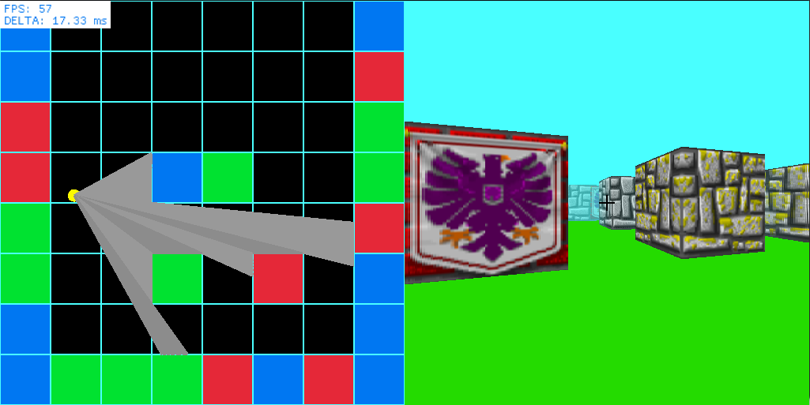
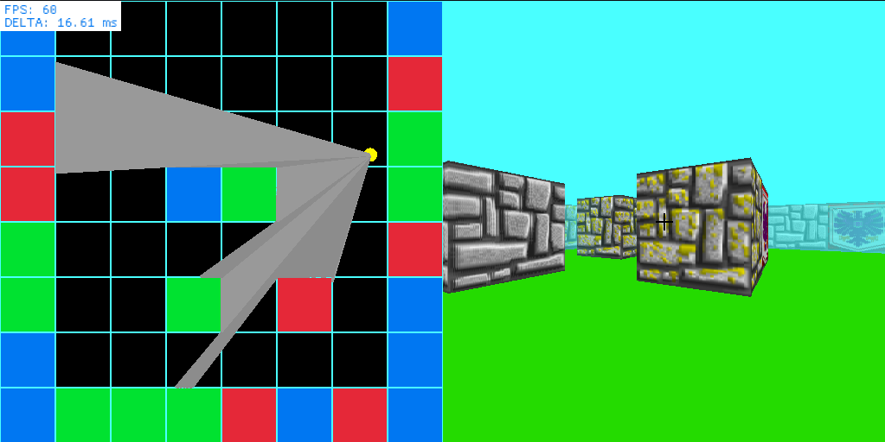

# 3D-Raycaster

Wolfenstein 3D like raycaster using Macroquad in Rust running on the web

## Features

- Digital differential analyser (DDA) raycaster
	- Like Wolfenstein 3D
- Textured walls
	- With multiple textures
- Minimap
- Ability to look up and down
- Fog effect
- Wall collisions

## Showcase

## Controls

- WASD to move
- Arrow keys to turn/look around
- Mouse to movement to look around (must click inside window to grab mouse)
- Esc to release mouse grab

## Copyright stuff

- Textures are from ID Software's Wolfenstein 3D

## Bugs

- Mouse grab on Windows??
- Mouse grab on web?
